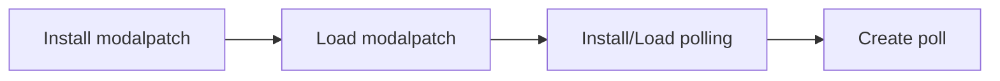

# Polling Cog - Modal Migration Guide

## Overview

The polling cog has been updated to use **True Discord Modals** with select menus for voting, replacing the previous View-based button approach.

### Before vs After

**Before (View-based):**
```
[Results] [Hero's Realm] [Sword Trial]
[Party] [Breaking Army] [Showdown]
  ↓
Click button → Ephemeral view with dropdowns → Submit
```

**After (Modal-based):**
```
[Vote 🗳️] [Results 🏆]
  ↓
Click "Vote" → Modal popup with ALL event select menus → Submit once
```

## Key Benefits

✅ **Single Modal Voting**: Vote for all events at once instead of one-by-one
✅ **Native Modal UX**: Uses Discord's modal popup interface
✅ **Cleaner UI**: Just 2 buttons (Vote + Results) instead of 6
✅ **Better Mobile Experience**: Modals are optimized for mobile
✅ **Faster Workflow**: No need to click multiple buttons

## Requirements

### ⚠️ CRITICAL: ModalPatch Dependency

The polling cog **REQUIRES** the `modalpatch` cog to function:

```bash
# 1. Install modalpatch
[p]cog install asdas-cogs modalpatch

# 2. Load ModalPatch FIRST
[p]load modalpatch

# 3. Then load/reload polling
[p]reload polling
```

**Why?** Discord.py doesn't natively support Select components in Modals. ModalPatch monkey-patches discord.py to enable this functionality.

## Installation Order



**INCORRECT ORDER WILL CAUSE VOTING TO FAIL!**

## Usage

### Creating a Poll

```
[p]eventpoll create
```

Same as before - creates a poll message with two buttons:
- **Vote 🗳️** - Opens the unified voting modal
- **Results 🏆** - Shows current results

### Voting

1. Click the **Vote** button
2. A modal opens with select menus for all 5 events:
   - 🗡️ Hero's Realm (multi-select: Fri + Sun times)
   - ⚔️ Sword Trial (multi-select: Fri + Sun times)
   - 🎉 Party (single-select: time only)
   - 🛡️ Breaking Army (multi-select: up to 2 day+time slots)
   - 🔥 Showdown (multi-select: up to 2 day+time slots)
3. Select your preferred times for any/all events
4. Click **Submit**
5. All selections saved at once ✅

### Event-Specific Selection Limits

| Event | Type | Selections Allowed |
|-------|------|-------------------|
| Hero's Realm | Fixed Days (Fri/Sun) | Up to 2 (one per day) |
| Sword Trial | Fixed Days (Fri/Sun) | Up to 2 (one per day) |
| Party | Daily | 0-1 time |
| Breaking Army | Weekly | Up to 2 day+time slots |
| Showdown | Weekly | Up to 2 day+time slots |

## Modal Structure

### Component Breakdown

The modal contains 5 Select components (max allowed in Discord modals):

```python
Modal Title: "Vote for Event Times"

Components:
1. Select: Hero's Realm (Fri/Sun times) - max 2 selections
2. Select: Sword Trial (Fri/Sun times) - max 2 selections
3. Select: Party (times) - max 1 selection
4. Select: Breaking Army (day+time combos) - max 2 selections
5. Select: Showdown (day+time combos) - max 2 selections
```

### Value Encoding

Select values are encoded as pipe-delimited strings:

**Daily Event (Party):**
```
"Party|||19:00-20:00"
```

**Fixed Days (Hero's Realm, Sword Trial):**
```
"Hero's Realm|||Friday|||19:00-21:00"
"Sword Trial|||Sunday|||20:00-22:00"
```

**Weekly (Breaking Army, Showdown):**
```
"Breaking Army|||Wednesday|||19:00-21:00"
"Showdown|||Saturday|||20:00-22:00"
```

### Parsing Logic

On submit, the modal:
1. Iterates through all select components
2. Parses selected values by splitting on `|||`
3. Groups by event name
4. Validates for conflicts
5. Saves to database

## Technical Details

### File Changes

**New Files:**
- `polling/modals.py` - EventVotingModal class

**Modified Files:**
- `polling/views.py` - Simplified EventPollView (Vote + Results buttons only)
- `polling/info.json` - Updated description and install message

**Preserved Files:**
- `polling/polling.py` - Core logic unchanged
- Old View classes (PartyModal, FixedDaysModal, WeeklyEventModal) kept as fallback

### EventVotingModal Class

```python
class EventVotingModal(Modal, title="Vote for Event Times"):
    def __init__(self, cog, guild_id, poll_id, user_id, events, user_selections):
        # Add 5 select menus dynamically
        self._add_daily_event_select(...)      # Party
        self._add_fixed_days_event_select(...) # Hero's Realm, Sword Trial
        self._add_weekly_event_select(...)     # Breaking Army, Showdown

    async def on_submit(self, interaction):
        # Parse all selections
        # Validate conflicts
        # Save to database
        # Update poll display
```

### Select Menu Options

Due to Discord's 25-option limit per select menu, options are constrained:

**Hero's Realm / Sword Trial:**
- ~12 time slots per day
- Combined into single select: "Fri: 19:00", "Sun: 20:00", etc.

**Breaking Army / Showdown:**
- ~3 time slots per day
- 7 days × 3 times = 21 options (fits in 25 limit)

**Party:**
- All available time slots (if <25)

## Conflict Detection

Conflict detection runs **after** all selections are made:

1. User submits modal with all selections
2. Modal parses selections
3. Calls `_check_conflicts()` for each event
4. If conflict found:
   - ❌ Show error message
   - Don't save any selections
   - User must re-submit
5. If no conflicts:
   - ✅ Save all selections
   - Update poll display

**Note:** Conflict checking logic is currently simplified. The full conflict detection from the cog can be integrated if needed.

## Troubleshooting

### "Failed to open voting modal"

**Cause:** ModalPatch not loaded

**Fix:**
```
[p]load modalpatch
[p]reload polling
```

### Modal shows but selects are text inputs

**Cause:** ModalPatch didn't patch successfully

**Fix:**
```
[p]modalpatchstatus   # Check if patch is active
[p]reload modalpatch  # Reapply patch
[p]reload polling
```

### Selections not saving

**Cause:** Discord's API rejecting select components

**Fix:**
- Check bot logs for errors
- Verify ModalPatch is loaded
- Try `[p]modalpatchtest` to test patch functionality

### "This poll is no longer active!"

**Cause:** Poll message ID doesn't match database entry

**Fix:**
- Create a new poll with `[p]eventpoll create`
- Don't manually delete/recreate poll messages

## Migration Notes

### For Users

No migration needed! Existing polls will automatically use the new modal interface when you click "Vote".

### For Developers

**Old View Classes Still Available:**
- `PartyModal`
- `FixedDaysModal`
- `WeeklyEventModal`

These are kept in `views.py` as fallback but are no longer used by EventPollView.

**To Revert to Old System:**
1. Restore the `_create_event_callback()` method in EventPollView
2. Re-add individual event buttons in `__init__()`
3. Remove ModalPatch dependency from info.json

## Future Considerations

### If discord.py adds native Modal Select support:

```python
# ModalPatch can be removed
# Code will work without changes (same API)
# Update info.json to remove ModalPatch requirement
```

### If Discord removes API support:

```python
# Fall back to old View-based system
# Restore event buttons
# Remove modals.py
```

### Potential Enhancements:

1. **Pagination**: If options exceed 25, split into multiple modals with "Next" button
2. **Smart Defaults**: Pre-select user's previous week's choices
3. **Conflict Preview**: Show potential conflicts before submission
4. **Batch Clear**: Add "Clear All" button to modal

## Testing

### Manual Testing Steps

1. Load ModalPatch
2. Reload polling cog
3. Create a poll
4. Click "Vote" button
5. Verify modal shows with 5 select menus
6. Select times for multiple events
7. Submit
8. Verify selections saved
9. Click "Vote" again
10. Verify previous selections are pre-selected (default=True)

### Automated Testing

```bash
# Run polling cog tests
python3 -m pytest asdas-cogs/polling/test_*.py -v

# Run ModalPatch tests
python3 -m pytest asdas-cogs/modalpatch/test_modalpatch.py -v
```

## Performance Impact

**Positive:**
- ✅ Fewer API calls (1 modal submit vs N button interactions)
- ✅ Fewer ephemeral messages (1 vs N)
- ✅ Less database writes (batch update vs incremental)

**Negative:**
- ⚠️ Slightly larger modal payload (all 5 selects sent at once)
- ⚠️ ModalPatch overhead (minimal, only affects _refresh method)

**Net Result:** Overall performance improvement due to reduced API round-trips.

## Support

For issues specific to:
- **Modal voting:** Check polling cog logs
- **Select components not working:** Check ModalPatch status (`[p]modalpatchstatus`)
- **Discord API rejections:** Monitor Discord developer portal for API changes

Report bugs on the asdas-cogs GitHub repository.

## Changelog

### v2.0 - Modal-Based Voting
- ✨ New: Unified voting modal with all events
- ✨ New: Single-submit workflow
- 🔧 Changed: EventPollView now has 2 buttons (Vote + Results)
- 🔧 Changed: Requires ModalPatch cog
- 📦 Kept: Old View classes as fallback
- 🐛 Fixed: Cancel button removed (from previous update)
- 🐛 Fixed: Error messages no longer auto-delete (from previous update)

### v1.x - View-Based Voting
- Individual buttons for each event type
- Separate ephemeral views for each selection
- No ModalPatch requirement
